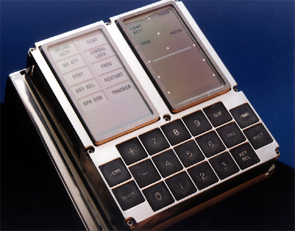

This blog is named Pinball Game Buttons. My consulting firm is called [PBGB Creative](https://pbgb.io) which is a weird acronym for Pinball Game Buttons lifted from a very important program in computer science and American history. The story starts 50 years ago with the Apollo space program's guidance computer.


> This is the User Interface. [Photo from NASA](http://www.nasa.gov/centers/dryden/about/Organizations/Technology/Facts/TF-2001-02-DFRC_prt.htm)

## The Apollo Guidance Computer (AGC)

I have been a Apollo moon mission fan for decades. Around the time I was dreaming of becoming an independant consultant the [Apollo guidance program source code](https://github.com/chrislgarry/Apollo-11) was posted to GitHub. This was right up my alley and I looked around in the source code and found a lot of fun comments and file names. One file name stuck with me. 

```PINBALL_GAME_BUTTONS_AND_LIGHTS.agc```

It stuck mostly because it had a [fun story](https://github.com/chrislgarry/Apollo-11/blob/master/Luminary099/PINBALL_GAME_BUTTONS_AND_LIGHTS.agc#L61-L73) in the file header comments that seems a common problem in software development.

> In short order, some of the coders threw together a demo program, inventing and using the verb/noun user-interface concept (in the whimsical fashion seen in much of this code), but without any idea that the verb/noun concept would somehow survive into the flight software.  As time passed, and more and more people became familiar with the demo, nobody got around to inventing an improvement for the user interface, so the coders simply built it into the flight software without any specific requirements to do so.

When you watch Apollo documentaries like the excellent HBO mini-series [From the Earth to the Moon](https://www.hbo.com/from-the-earth-to-the-moon). You get to see the guidance computer and its user interface in action. The verb/noun interface has a beautiful simplicity. It simply does not get in the way. Knowing what the verbs do and what nouns they affect is not discoverable. But spaceflight is dangerous and astronauts train. A lot. They train to know all the verbs and all the nouns by heart intimately. Ease of use and discoverability is **not** a requirement.

What I mostly love about the comment above is the stab at a demo which becomes the defacto user experience because no one can think of a better way on their time schedule. This scenario plays out all the time in software development. You do the simplest thing with every intention of coming back to the problem. But, chances are if the solution you came up with is not horrible and there is a long list of other objectives. You will **not** get a chance to make your first attempt better.

## Want to know more?

There is a lot out there about the Apollo Guidance Computer this video does a great job covering the verb/noun user interface. 

`youtube:https://www.youtube.com/embed/b8S_T772H1c?start=254`
